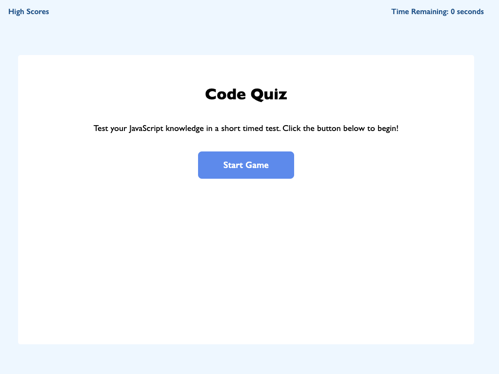

# JavaScript Timed Quiz

## Description

This project is a JavaScript quiz that can be used to test one's knowledge of basic JavaScript concepts. The user's score is stored in the browser and can be saved under their initials.

Link to live application: https://whitbreezy.github.io/js-quiz/

## Installation

Visit my github repo and clone to your machine:
https://github.com/whitbreezy/js-quiz

## Usage

See below for screenshot of working application:

## Credits

I got some of my quiz questions from this website: https://basescripts.com/110-javascript-quiz-questions-with-solutions-pdf-download-test-your-knowledge

I got some help with my looping and getting the next question to appear from here:
https://www.geeksforgeeks.org/how-to-create-a-simple-javascript-quiz/

I also got some help from the class code/notes from my coding bootcamp.

## License

See github repo for license info.

